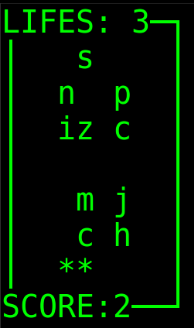

# JOGO: HOW FAST YOU TYPE?

## Descrição do Jogo

Este é um jogo desenvolvido em python, com o objetivo de testar a velocidade com que a pessoa consegue digitar uma sequência aleatória de caracteres. O jogo é composto por três colunas de caracteres, geradas aleatoriamente. O jogador deve pressionar as teclas no teclado, conforme os caracteres aparecem na tela. Cada caractere acertado resultada em mais 1 ponto para o jogador. Existem 3 vidas disponíveis, ou seja, o jogador pode deixar passar no máximo 3 caracteres sem pressioná-los. Ao chegar em 0 vidas, o jogo se encerra.

***

## Instruções

Este jogo foi desenvolvido para rodar em sistemas Linux, mas fique à vontade para testar nos demais.
A biblioteca usada como base para a 'interface' foi a [Curses](https://docs.python.org/3/howto/curses.html).

Para gerar o menu do jogo, foi utilizado [ESSE](https://gist.github.com/abishur/2482046) exemplo como base.

Para rodar o jogo, abra o terminal e execute: #python2.7 menu.py. Siga as intruções do menu. Caso queira encerrar a aplicação no meio do jogo, pressione ESPAÇO.

> Divirta-se.

***
