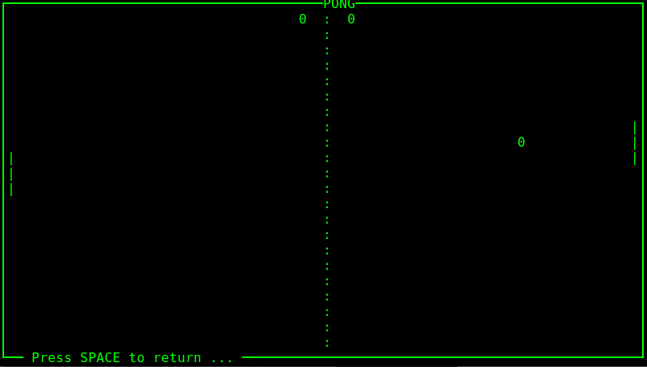

# SIMULAÇÃO DO JOGO PONG

## Descrição do Jogo

Esta é uma aplicação desenvolvido em python, com o objetivo de relembrar o nostálgico jogo PONG. A simulação é composta por duas Inteligência Artificiais que jogam entre si.

***

## Instruções

Esta aplicação foi desenvolvida para rodar em sistemas Linux, mas fique à vontade para testar nos demais.
A biblioteca usada como base para a 'interface' foi a [Curses](https://docs.python.org/3/howto/curses.html).

Para gerar o menu da aplicação, foi utilizado [ESSE](https://gist.github.com/abishur/2482046) exemplo como base.

Para rodar a simulação, abra o terminal e execute: #python2.7 menu.py. Siga as intruções do menu. Caso queira encerrar a aplicação no meio do jogo, pressione ESPAÇO.

> Divirta-se.

***
